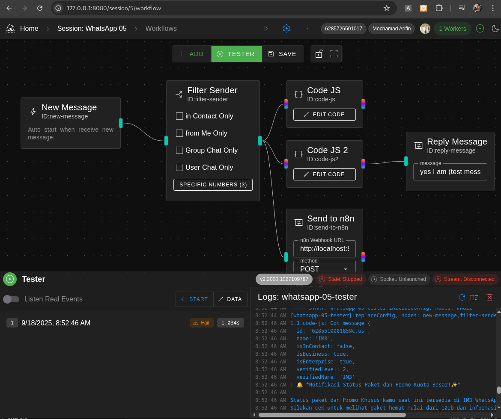

# WhatsApp Remote




## How to Use

## Use Prebuilt Binary

You can just download the prebuilt dist binary
| OS          |  Prebuilt Binary File |
|-------------|-----------------------|
| Linux (x64)   | [whatsapp-remote-linux-x64.zip](dist/whatsapp-remote-linux-x64.zip)       |
| MacOS (arm64) | [whatsapp-remote-darwin-arm64.zip](dist/whatsapp-remote-darwin-arm64.zip) |
| Windows (x64) | [whatsapp-remote-win-x64.zip](dist/whatsapp-remote-win-x64.zip)           |

## Built and run your own

If you have nodejs (at least v22), you can just build it from source:

``` sh

npm ci
npm run build
npm run prod
```

# Dev Info

## Get WaWeb index.html

Update the Web Whatsapp version.
Current WaWeb version: 2.3000.1024517539


``` sh
curl -H 'sec-fetch-site: same-origin' -H 'upgrade-insecure-requests: 1'  -H 'cache-control: max-age=0' -H 'accept-language: en,id;q=0.9' -H 'accept: text/html' -A 'Mozilla/5.0 (X11; Linux x86_64) AppleWebKit/537.36 (KHTML, like Gecko) Chrome/137.0.0.0 Safari/537.36' -H 'viewport-width: 1193' -o src/waweb/index.html https://web.whatsapp.com/

```
