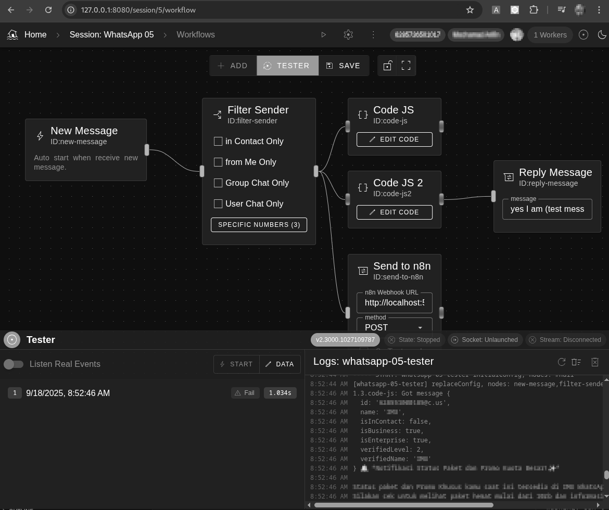

# WhatsApp Remote

**WhatsApp Remote** is an open-source automation tool that lets you build workflows to interact with **WhatsApp messages in real-time**.
Think of it like **Node-RED for WhatsApp** – receive messages, filter senders, run custom logic, call APIs, and send automated replies — all through a visual workflow editor.

---

## ✨ Features

* 📩 **Receive WhatsApp messages** in real-time
* 🔍 **Filter senders** (specific numbers, groups, or contacts only)
* 🧑‍💻 **Run custom JavaScript code** on incoming messages
* 🌐 **Send events to external systems** (e.g., n8n, webhooks, APIs)
* 🤖 **Auto-reply messages** with configurable templates
* 🖥 **Visual workflow editor** with drag-and-drop nodes
* 📸 **View Browser Screen** even in headless mode
* 🔓 100% **self-hosted & open-source**

---


*Example: Receive a message → Filter sender → Run code → Send to n8n → Reply back on WhatsApp*

## Installation

## Use Prebuilt Binary

You can just download the prebuilt dist binary
| OS          |  Prebuilt Binary File |
|-------------|-----------------------|
| Linux (x64)   | [whatsapp-remote-linux-x64.zip](dist/whatsapp-remote-linux-x64.zip)       |
| MacOS (arm64) | [whatsapp-remote-darwin-arm64.zip](dist/whatsapp-remote-darwin-arm64.zip) |
| Windows (x64) | [whatsapp-remote-win-x64.zip](dist/whatsapp-remote-win-x64.zip)           |

## Built and run your own

If you have nodejs (at least v22), you can just build it from source:

``` sh
git clone https://github.com/n0d3-plus/whatsapp-remote.git
cd whatsapp-remote
npm ci
npm run build
npm run prod
```

Then open your browser at:

```
http://127.0.0.1:8080
```
---

## Usage

1. **Login with WhatsApp**

   * Start the app and scan the QR code with your WhatsApp app.
   * Once connected, incoming messages will start flowing into the system.

2. **Create Workflows**

   * Add triggers (e.g., *New Message*)
   * Add filters (*specific numbers, group only, etc.*)
   * Add processors (*JavaScript code, API calls, etc.*)
   * Add responders (*Reply Message*)

3. **Integrate with external apps**

   * Use the **Send to n8n** node or **HTTP Webhook** to connect with your automation system.

---


## Nodes

* **New Message** → Trigger when a new WhatsApp message is received
* **Filter Sender** → Only allow specific senders or groups
* **Code JS** → Run custom JavaScript
* **Send to n8n** → Forward event via HTTP POST
* **Reply Message** → Send auto-replies

---

## Tech Stack

* **Node.js** (backend)
* **WebSocket** (real-time events)
* **Custom Workflow Engine**
* **WhatsApp Web API (via puppeteer)**

## Contributing

Contributions are welcome!

1. Fork the repo
2. Create a new branch (`feature/my-feature`)
3. Commit your changes
4. Push the branch and create a PR

